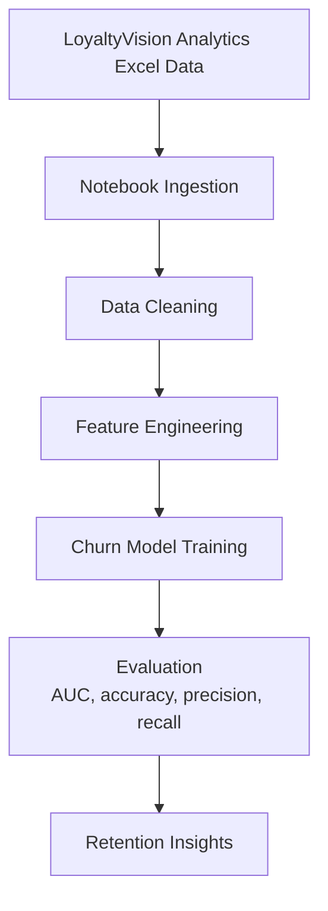

# Customer Churn Prediction

**GitHub Repository:** [praveenraj9623-sketch/customer-churn-prediction](https://github.com/praveenraj9623-sketch/customer-churn-prediction)

> A notebook-based customer churn prediction project using customer behavior and loyalty data to train a churn model, evaluate classification performance, and identify drivers of customer attrition.

[](https://jupyter.org)
[](https://python.org)
[](https://pandas.pydata.org)
[](https://scikit-learn.org)

[](https://praveenraj9623-sketch.github.io/)
[](https://github.com/praveenraj9623-sketch/customer-churn-prediction)

---

## What is This Project?

This project analyzes customer churn using a Jupyter notebook and an Excel dataset named `LoyaltyVision Analytics.xlsx`. It is a compact churn analytics workflow for exploring customer attributes, building predictive features, and evaluating churn classification performance.

**Core outcome:** customer dataset -> EDA -> feature engineering -> churn model -> performance metrics -> retention insights.

---

## Workflow Architecture



---

## Tech Stack

| Category | Tools |
|---|---|
| Environment | Jupyter Notebook |
| Language | Python |
| Data Source | Excel workbook |
| Data Processing | Pandas, NumPy |
| Modeling | scikit-learn / LightGBM-style churn workflow |
| Visualization | Matplotlib, Seaborn |

---

## Repository Contents

```text
customer-churn-prediction/
|-- customer-churn-prediction.ipynb
|-- LoyaltyVision Analytics.xlsx
`-- README.md
```

---

## How to Run

```bash
git clone https://github.com/praveenraj9623-sketch/customer-churn-prediction.git
cd customer-churn-prediction
python -m venv .venv
.venv\Scripts\activate
pip install pandas numpy matplotlib seaborn scikit-learn lightgbm openpyxl jupyter
jupyter notebook
```

Open:

```text
customer-churn-prediction.ipynb
```

---

## Suggested Analysis Flow

1. Load the Excel dataset.
2. Inspect churn label distribution.
3. Clean missing values and categorical variables.
4. Create model-ready features.
5. Train churn classification models.
6. Evaluate model quality using ROC-AUC, precision, recall, and confusion matrix.
7. Summarize retention recommendations.

---

## Limitations

- This is a notebook project and does not include a deployed dashboard or API.
- Churn predictions should be validated against fresh customer data before business use.
- Model performance can change when customer behavior or product pricing changes.

---

## Future Improvements

- Convert the notebook into a Streamlit dashboard.
- Add SHAP feature explanations.
- Add customer risk segmentation.
- Add batch scoring export for retention campaigns.

---

## Author

Built by **Praveen Raj A**

- GitHub: https://github.com/praveenraj9623-sketch
- LinkedIn: https://www.linkedin.com/in/praveen-raj-a-b05abb2a3/
- Repository: https://github.com/praveenraj9623-sketch/customer-churn-prediction
